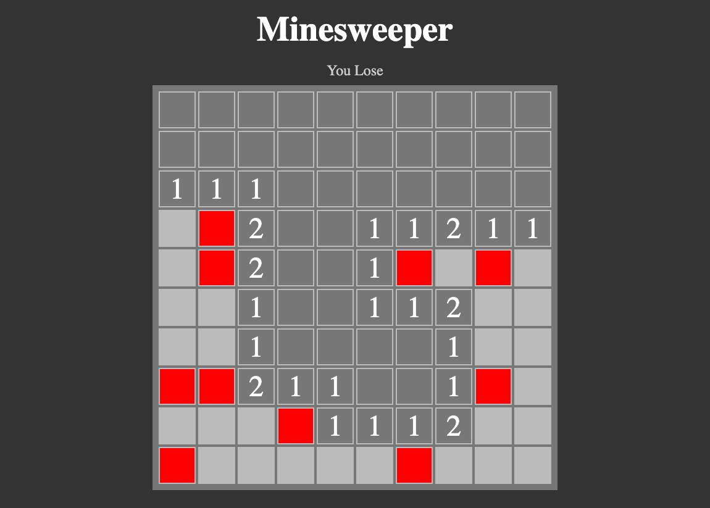

# Mine Sweeper

- Minesweeper rules are very simple. The board is divided into cells, with mines randomly distributed. To win, you need to open all the cells. The number on a cell shows the number of mines adjacent to it. Using this information, you can determine cells that are safe, and cells that contain mines. Cells suspected of being mines can be marked with a flag using the right mouse button.

# Screenshot



# Getting started
For starting the app in your machine, open the terminal and follow these commands:

git clone the repo
```
git clone https://github.com/Vinay-Basargekar/MineSweeper.git
```

cd into working directory
```
cd MineSweeper
```

Install dependencies
```
npm install
```

For starting react app:
```
npm run dev
```
open http://localhost:5173/ in browser to access the app

# Goals
- To learn TypeScript